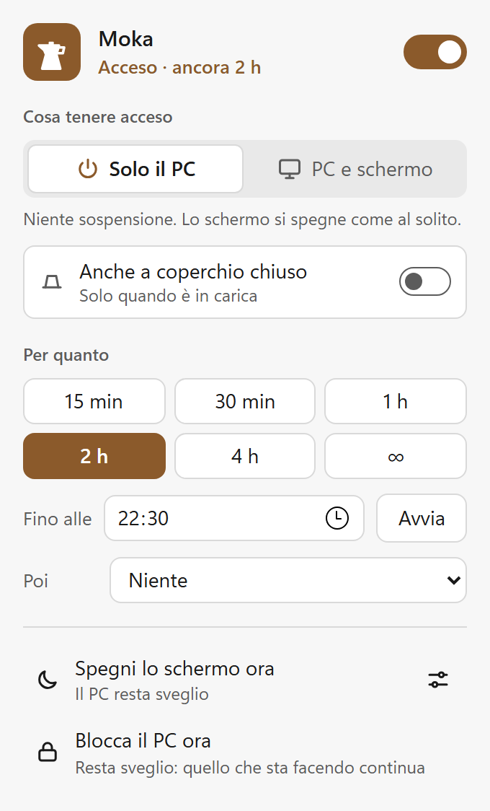
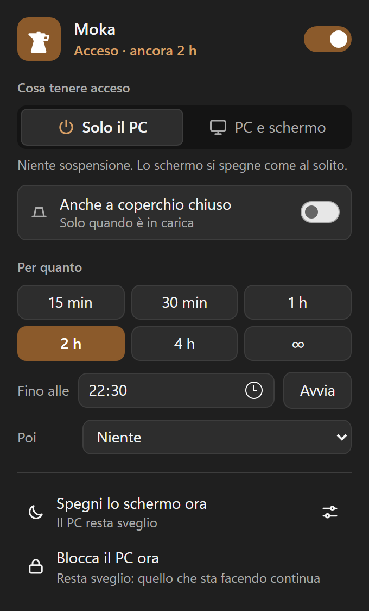

# Moka

Tieni sveglio il PC Windows dalla tray. · Keep your Windows PC awake from the tray.

[🇮🇹 Italiano](#italiano) · [🇬🇧 English](#english)

<p>
  
  
</p>

---

## Italiano

Tieni sveglio il tuo PC Windows, nello spirito di [Amphetamine](https://apps.apple.com/us/app/amphetamine/id937984704?mt=12) su macOS: dalla tray scegli se tenere acceso il PC, anche lo schermo, oppure spegnere solo lo schermo lasciando il PC sveglio — a tempo, fino a un'ora precisa, per sempre, o con regole automatiche.

**Stato: 0.6.1, pubblicata.** Novità di ogni versione in [CHANGELOG.md](CHANGELOG.md), il piano completo in [docs/ROADMAP.md](docs/ROADMAP.md).

### Installare

**[⬇ Scarica l'ultima versione](https://github.com/TarducciM/Moka/releases/latest)** — Windows 10 o 11, 64 bit.

| File | Quando sceglierlo |
| --- | --- |
| `Moka_x.y.z_x64-setup.exe` | **Consigliato.** Installer normale (NSIS) |
| `Moka_x.y.z_x64_en-US.msi` | Se preferisci un MSI (distribuzione aziendale, criteri di gruppo) |
| `Moka_x.y.z_x64-portable.exe` | Un solo eseguibile, nessuna installazione: per provarla |

Moka si installa **solo per il tuo utente**, in `%LOCALAPPDATA%\Moka`: non serve l'amministratore. L'installer chiede, in un'unica pagina e con tre caselle che parti già spuntate come sta adesso sul tuo PC, se vuoi l'avvio automatico all'accesso, il collegamento nel menu Start e quello sul desktop. Rilanciandolo quando Moka c'è già, apre una pagina di manutenzione: **ripara** (o aggiorna) tenendo le impostazioni, **disinstalla e reinstalla da capo**, oppure **disinstalla e basta**. Si disinstalla da "App e funzionalità", e in ogni caso rimette com'era l'impostazione di Windows per il coperchio se Moka la stava cambiando.

Non è firmata, quindi la prima volta Windows SmartScreen può mostrare un avviso ("Maggiori informazioni" → "Esegui comunque"). Serve il runtime WebView2, che c'è di serie su Windows 11 e su Windows 10 aggiornato; se manca, l'installer lo aggiunge.

Gli aggiornamenti successivi arrivano da soli: Moka controlla una volta al giorno — è l'unico momento in cui si collega a Internet — verifica la firma di quello che scarica, e **non si aggiorna mai mentre una sessione è attiva**, perché il PC cadrebbe a metà. Puoi anche chiederlo tu da Impostazioni → Cerca aggiornamenti.

La versione portable va bene per una prova. Se la cancelli mentre sta tenendo acceso un portatile a coperchio chiuso, l'impostazione di Windows resta cambiata: il comando per rimetterla a posto è [più sotto](#se-limpostazione-del-coperchio-resta-cambiata).

### Cosa fa

- Due modalità: solo il PC, oppure PC e schermo. In più "spegni lo schermo ora" lasciando il PC sveglio (sui portatili con standby moderno è ancora in prova: vedi [docs/SPIKE.md](docs/SPIKE.md))
- Durate rapide (15 min … 4 h, personalizzabili), "fino alle HH:MM", "finché non lo spengo"
- Icona nella tray che mostra lo stato, pannello accanto all'icona, menu del clic destro
- Riga di comando per script e automazioni
- La sessione sopravvive a un crash dell'app, ma non a un riavvio del PC
- Portatili: resta acceso anche a coperchio chiuso, solo in carica o anche a batteria, con modalità scrivania, protezione zaino e blocco alla riapertura. L'impostazione di Windows torna sempre com'era, anche dopo un crash. Sui portatili con standby moderno è ancora in prova (vedi [docs/SPIKE.md](docs/SPIKE.md))
- Soglia batteria: sotto una certa carica la sessione finisce da sola
- "…e poi": a fine sessione spegni lo schermo, blocca, sospendi, iberna o spegni, sempre dopo un conto alla rovescia annullabile; e 5 minuti prima un avviso con "+30 min". Lo scegli una volta nelle Impostazioni ("Quando una sessione finisce") oppure solo per la sessione in corso dal pannello. Di suo, quando il tempo finisce, Moka non fa niente: lascia il PC e Windows torna a comportarsi come al solito
- "Blocca il PC ora": blocca lo schermo lasciando il PC sveglio, così quello che sta facendo continua (anche da `moka --lock`)
- Tasti rapidi globali per accendere, spegnere e spegnere lo schermo
- Regole automatiche: sveglio mentre un programma è aperto, sei in chiamata, c'è un'app a schermo intero, il PC è in carica, è collegato un monitor esterno, c'è un download in corso, il processore è occupato, è collegato un disco USB, sei su una certa rete, o in una fascia oraria. Ogni regola ha la sua modalità e il suo "…e poi", il pannello dice perché è acceso, e le regole si sospendono per un'ora con un clic
- Presenza (facoltativa, spenta di default): dopo un minuto senza toccare niente preme F15, così niente salvaschermo, blocco per inattività o stato "Assente". Il blocco per inattività esiste per sicurezza: sui PC di lavoro può violare le regole aziendali
- "Perché non dorme? Perché si è svegliato?": Moka legge ciò che Windows sa già (registro eventi, dispositivi che possono svegliarlo, impostazioni di sospensione) e lo spiega a parole; chi tiene sveglio il PC lo chiede a `powercfg /requests`, solo se lo chiedi tu e con il permesso dell'amministratore. Dal menu della tray: "Perché non dorme?…"
- Aggiornamenti automatici firmati, mai durante una sessione
- Chi tiene sveglio il PC e perché si vede in `powercfg /requests` ("Moka: sveglio per 2 h, fino alle 16:12")
- Italiano e inglese
- Completamente locale: nessun account, nessun cloud, nessuna telemetria

### Dove stanno i tuoi dati

Impostazioni, regole e stato stanno in `%APPDATA%\com.moka.app`, cioè **fuori** dalla cartella del programma: sopravvivono a un aggiornamento e anche a una disinstallazione. Niente esce dal PC, mai: l'unica connessione che Moka apre è il controllo degli aggiornamenti.

### Cosa farà

- Pubblicazione su winget
- Lo [spike sullo standby moderno](docs/SPIKE.md), che deciderà quanto si può promettere a coperchio chiuso sui portatili recenti

### Riga di comando

```text
moka                  apre il pannello
moka --for 2h         sveglio per 2 ore (anche 90m, 1h30m)
moka --until 18:30    fino alle 18:30
moka --forever        finché non lo spengo
moka --screen         anche lo schermo (si combina con le altre)
moka --on / --off     accende con l'ultima scelta / spegne
moka --toggle         accende o spegne
moka --screen-off     spegne subito lo schermo, il PC resta sveglio
moka --lock           blocca il PC, che resta sveglio
moka --quit           chiude Moka
moka --then sleep     a fine sessione: display-off, lock, sleep, hibernate, shutdown
moka --lid / --no-lid questa sessione resta accesa (o no) a coperchio chiuso
moka --restore-lid    rimette l'impostazione del coperchio com'era
moka --while ffmpeg.exe    sveglio finché gira ffmpeg (con --screen e --then)
moka --while-pid 1234      sveglio finché vive il processo 1234
moka --pause-rules         sospende le regole per un'ora (--pause-rules=2h)
moka --resume-rules        le riattiva
```

Se Moka è già aperta, il comando arriva a lei.

#### Se l'impostazione del coperchio resta cambiata

Non dovrebbe succedere — Moka la rimette uscendo, dopo un crash e alla disinstallazione — ma se succede (per esempio cancellando la versione portable mentre la modifica era attiva), si rimette a mano da un prompt dei comandi:

```bash
powercfg /setacvalueindex SCHEME_CURRENT SUB_BUTTONS LIDACTION 1
```

```bash
powercfg /setdcvalueindex SCHEME_CURRENT SUB_BUTTONS LIDACTION 1
```

```bash
powercfg /setactive SCHEME_CURRENT
```

(1 = sospendi; su alcuni portatili l'impostazione è nascosta e la si legge con `powercfg /qh SCHEME_CURRENT SUB_BUTTONS LIDACTION`.)

### Sviluppo

Serve la [toolchain di Tauri](https://tauri.app/start/prerequisites/) (Rust con MSVC, Visual Studio Build Tools, WebView2, Node).

```bash
npm install
npm run dev                                          # Moka in modalità sviluppo
cargo test --manifest-path src-tauri/Cargo.toml      # test Rust
npm run check                                        # sintassi JS e traduzioni
npm run version:check                                # versione allineata ovunque
npm run build                                        # installer NSIS e MSI
```

Documentazione di progetto: [ROADMAP](docs/ROADMAP.md) (decisioni, architettura, trappole già pagate), [RELEASE](docs/RELEASE.md) (come si pubblica una versione), [SPIKE](docs/SPIKE.md) (la prova sullo standby moderno), [test.md](test.md) (cosa è verificato davvero e cosa no).

### Licenza

[MIT](LICENSE)

---

## English

Keep your Windows PC awake, in the spirit of [Amphetamine](https://apps.apple.com/us/app/amphetamine/id937984704?mt=12) on macOS: from the tray, choose whether to keep the system awake, the screen too, or turn off just the screen while the PC stays awake — for a set time, until a given time, indefinitely, or through automatic rules.

**Status: 0.6.1, released.** What changed in each version is in [CHANGELOG.md](CHANGELOG.md); the full plan is in [docs/ROADMAP.md](docs/ROADMAP.md) (in Italian).

### Install

**[⬇ Download the latest version](https://github.com/TarducciM/Moka/releases/latest)** — Windows 10 or 11, 64-bit.

| File | When to pick it |
| --- | --- |
| `Moka_x.y.z_x64-setup.exe` | **Recommended.** Regular installer (NSIS) |
| `Moka_x.y.z_x64_en-US.msi` | If you prefer an MSI (enterprise deployment, group policy) |
| `Moka_x.y.z_x64-portable.exe` | A single executable, no install: for a quick try |

Moka installs **for your user only**, into `%LOCALAPPDATA%\Moka`: no administrator needed. The installer asks on a single page, with three checkboxes that start from how your PC is right now, whether you want it to start with Windows, a Start menu shortcut and a desktop shortcut. Run it again when Moka is already installed and it opens a maintenance page: **repair** (or update) keeping your settings, **uninstall first and install from scratch**, or **uninstall and stop there**. It uninstalls from "Apps & features" and, either way, puts the Windows lid setting back as it was if Moka was changing it.

It is not code-signed, so the first time Windows SmartScreen may show a warning ("More info" → "Run anyway"). It needs the WebView2 runtime, which ships with Windows 11 and with an up-to-date Windows 10; if it is missing, the installer adds it.

Later updates arrive on their own: Moka checks once a day — the only moment it connects to the internet — verifies the signature of what it downloads, and **never updates while a session is active**, because the PC would drop out halfway. You can also ask for it from Settings → Check for updates.

The portable build is fine for a quick try. If you delete it while it is keeping a laptop awake with the lid closed, the Windows setting stays changed: the command to restore it is [below](#if-the-lid-setting-stays-changed).

### What it does

- Two modes: PC only, or PC and screen. Plus "turn off the screen now" while the PC stays awake (still being tested on laptops with modern standby)
- Quick durations (15 min … 4 h, customizable), "until HH:MM", "until I turn it off"
- Tray icon that shows the state, a panel next to the icon, a right-click menu
- Command line for scripts and automation
- A session survives an app crash, but not a PC restart
- Laptops: stay awake with the lid closed, plugged in only or on battery too, with desk mode, bag protection and lock on reopen. The Windows setting always goes back as it was, even after a crash. Still being tested on laptops with modern standby
- Battery cutoff: the session ends on its own below a set charge
- "…and then": at the end of a session turn off the screen, lock, sleep, hibernate or shut down, always after a cancellable countdown; and 5 minutes before, a warning with "+30 min". Choose it once in Settings ("When a session ends") or just for the current session from the panel. By itself, when the time is up, Moka does nothing: it lets the PC go and Windows behaves as usual
- "Lock the PC now": locks the screen while the PC stays awake, so whatever it is doing keeps going (also `moka --lock`)
- Global keyboard shortcuts to turn it on, off, and turn off the screen
- Automatic rules: stay awake while a program is open, you're in a call, a full-screen app is showing, the PC is charging, an external monitor is connected, a download is running, the processor is busy, a USB drive is plugged in, you're on a given network, or during a time window. Each rule has its own mode and "…and then", the panel says why it's on, and rules pause for an hour with one click
- Presence (optional, off by default): after a minute without input it presses F15, so no screen saver, idle lock or "Away" status. The idle lock exists for security: on work PCs this may break company rules
- "Why won't it sleep? Why did it wake up?": Moka reads what Windows already knows (event log, devices that can wake it, sleep settings) and explains it in plain words; who keeps the PC awake comes from `powercfg /requests`, only when you ask and with administrator permission. From the tray menu: "Why won't it sleep?…"
- Signed automatic updates, never during a session
- `powercfg /requests` shows who is keeping the PC awake and why ("Moka: awake for 2 h, until 16:12")
- Italian and English UI
- Fully local: no account, no cloud, no telemetry

### Where your data lives

Settings, rules and state live in `%APPDATA%\com.moka.app`, that is **outside** the program folder: they survive an update and even an uninstall. Nothing ever leaves the PC: the only connection Moka opens is the update check.

### Planned

- Publishing on winget
- The [modern standby spike](docs/SPIKE.md), which will decide how much can be promised with the lid closed on recent laptops

### Command line

```text
moka                  opens the panel
moka --for 2h         awake for 2 hours (also 90m, 1h30m)
moka --until 18:30    until 18:30
moka --forever        until I turn it off
moka --screen         screen too (combines with the others)
moka --on / --off     turn on with the last choice / turn off
moka --toggle         turn on or off
moka --screen-off     turn off the screen now, the PC stays awake
moka --lock           lock the PC, which stays awake
moka --quit           quit Moka
moka --then sleep     at the end: display-off, lock, sleep, hibernate, shutdown
moka --lid / --no-lid this session stays on (or not) with the lid closed
moka --restore-lid    put the lid setting back as it was
moka --while ffmpeg.exe    awake while ffmpeg runs (with --screen and --then)
moka --while-pid 1234      awake while process 1234 is alive
moka --pause-rules         pause rules for an hour (--pause-rules=2h)
moka --resume-rules        resume them
```

If Moka is already running, the command goes to it.

#### If the lid setting stays changed

It shouldn't happen — Moka restores it on exit, after a crash and on uninstall — but if it does (for example by deleting the portable build while the change was active), restore it by hand from a command prompt:

```bash
powercfg /setacvalueindex SCHEME_CURRENT SUB_BUTTONS LIDACTION 1
```

```bash
powercfg /setdcvalueindex SCHEME_CURRENT SUB_BUTTONS LIDACTION 1
```

```bash
powercfg /setactive SCHEME_CURRENT
```

(1 = sleep; on some laptops the setting is hidden and you can read it with `powercfg /qh SCHEME_CURRENT SUB_BUTTONS LIDACTION`.)

### Development

You need the [Tauri toolchain](https://tauri.app/start/prerequisites/) (Rust with MSVC, Visual Studio Build Tools, WebView2, Node).

```bash
npm install
npm run dev                                          # run Moka in development
cargo test --manifest-path src-tauri/Cargo.toml      # Rust tests
npm run check                                        # JS syntax and translations
npm run version:check                                # version aligned everywhere
npm run build                                        # NSIS and MSI installers
```

Project docs (Italian): [ROADMAP](docs/ROADMAP.md) (decisions, architecture, traps already paid for), [RELEASE](docs/RELEASE.md) (how a version is published), [SPIKE](docs/SPIKE.md) (the modern standby test), [test.md](test.md) (what is actually verified and what is not).

### License

[MIT](LICENSE)
